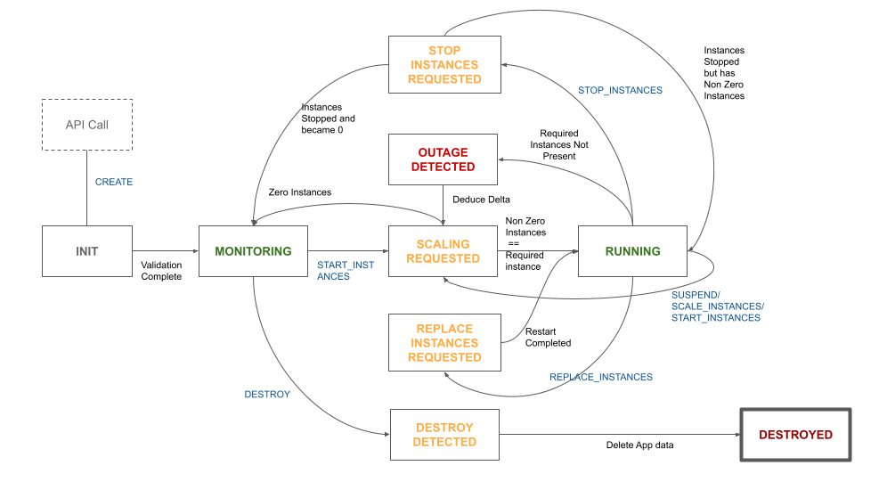

# Introduction

An **application** is a virtual representation of a running service in the system.

Running containers for an application are called **application instances**.

An application **specification** contains the following details about the application:

- **Name** - Name of the application
- **Version** - Version of this specification
- **Executable** - The container to deploy on the cluster
- **Ports** - Ports to be exposed from the container
- **Resources** - CPU and Memory required for the container
- **Placement Policy** - How containers are to be placed in the cluster
- **Healthchecks** - Healthcheck details
- **Readiness Checks** - Readiness checks to pass before container is considered to be healthy
- **Pre Shutdown Hooks** - Pre shutdown hooks to run on container before it is killed
- **Environment Variables** - Environment variables and values
- **Exposure Information** - Virtual host information
- **Volumes** - Volumes to be mounted into the container
- **Configs** - Configs/files to be mounted into the container
- **Logging details** - Logging spec (for example rsyslog server)
- **Tags** - A map of strings for additional metadata

!!!info
    Once a spec is registered to the cluster, it can not be changed

## Application ID
Once an application is _created_ on the cluster, an Application id is generated. The format of this id currently is: `{name}-{version}`. All further operations to be done on the application will need to refer to it by this ID.

## Application States and Operations

An application on a Drove cluster follows a fixed lifecycle modelled as a state machine. State transitions are triggered by operations. Operations can be issued externally using API calls or may be generated internally by the application monitoring system.

### States
Applications on a Drove cluster can be one of the following states:

* **INIT** - This is an _intermediate state_ during which the application is being initialized and  the spec is being validated. This is the origination state of the application.
* **MONITORING** - A _stable state_ in which application is created or suspended and does not have any running instances
* **RUNNING** - A _stable state_ in which application has the expected non-zero number of healthy application instances running on the cluster
* **OUTAGE_DETECTED** - An _intermediate state_ when Drove has detected that the current number of application instances is not matching the expected number of instances.
* **SCALING_REQUESTED** - An intermediate state that signifies that application instances are being spun up or shut down to get the number of running instances to match the expected instances.
* **STOP_INSTANCES_REQUESTED** - An _intermediate state_ that signifies that specific instances of the application are being killed as requested by the user/system.
* **REPLACE_INSTANCES_REQUESTED** - An _intermediate state** **_that signifies that instances of the application are being replaced with newer instances as requested by the user. This signifies that the app is effectively being restarted.
* **DESTROY_REQUESTED** - An _intermediate state_ that signifies that the user has requested to destroy the application and remove it from the cluster.
* **DESTROYED** - An _intermediate state_ that signifies that the app has been destroyed and metadata cleanup is underway. This is the terminal state of an application.

### Operations
The following application operations are recognized by Drove:

* **CREATE** - Create an application. Take the Application Specification. Fails if an app with the same application id (name + version) already exists on the cluster
* **DESTROY** - Destroy an application. Takes app id as parameter. Deletes all metadata about the application from the cluster. Allowed only if the application is in Monitoring state (i.e. has zero running instances).
* **START_INSTANCES** - Create new application instances. Takes the app id as well as the number of _new_ instances to deploy. Allowed only if the application is in Monitoring or Running state.
* **STOP_INSTANCES** - Stop running application instances. Takes the app id, list of instance ids to be stopped as well as flag to denote if replacement instances are to be started by Drove or not. Allowed only if the application is in Monitoring or Running state.
* **SCALE** - Scale the application up and down to the specified number of instances. Drove will internally calculate whether to spin new containers up or spin old containers down as needed. Allowed if the app is in Monitoring or Running state. It is better to use either START or STOP instances command above to be more explicit in behavior. The SCALE operation is mostly for internal use by Drove, but can be issued externally as well.
* **REPLACE_INSTANCES** - Replace application instances with newer ones. Can be used to do rolling restarts on the cluster. Specific instances can be targeted as well by passing an optional list of instance ids to be replaced. Allowed only when the application is in Running state.
* **SUSPEND** - A shortcut to set expected instances for an application to zero. This will get translated into a SCALE operation and any running instances will be gracefully shut down. Allowed only when the application is in running state.
* **RECOVER** - Internal command used to restore application state on controller failover.

!!!tip
    All operations can take an optional Cluster Operation Spec which can be used to control the timeout and parallelism of tasks generated by the operation.

### Application State Machine

The following state machine signifies the states and transitions as affected by cluster state and operations issued.

